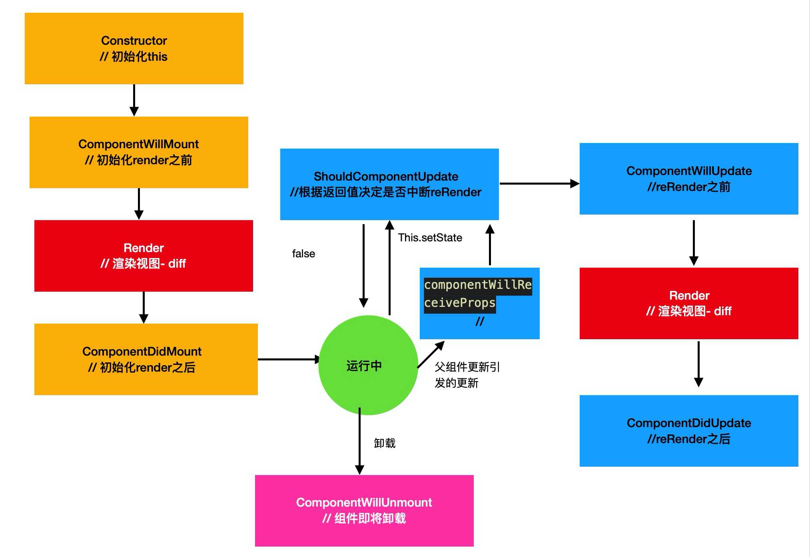

## react
> react  + react-dom 为什么分两个包？

因为react在设计之初就有跨平台的野望，所以react本身只专注vDom，具体到客户端的实现转换，有其他包来处理(react-dom for h5， react-native for native)。


## react-CDN-引入
为什么除了react/react-dom之外还要引入babel？
+ 为了解析jsx(html无法识别这种语法糖)

## 官方脚手架项目初始化

1. 初始化
```shell
npx create-react-app [project-name]
```

2. 配置项抽离
```shell
npm run eject
```

## jsx

1. 在react中，jsx是React.createElement的语法糖。
> createElement(type, props, children);

2. jsx内嵌入js表达式，只需要在js表达式外套一个花括号即可。

3. jsx的插槽可以嵌入数组，这意味着列表渲染直接嵌入数组就可以了。

4. jsx中给元素添加类名，不能用class(因为它与关键字class冲突)，要用className


## 组件的本质即函数（类）

> react中，常规模式下，有两种类型组件。
注意点：
+ 组件必须以大驼峰形式命名，其他规范以小驼峰为准。
+ 严格的**单项数据流**！跟vue不一样，在react组件中，组件自身的props是只读的。
    + react具有严格的单项数据流的特征，这使得它的数据管理十分的清晰和严明，这意味着我们在使用react构建我们的应用时，只需把控组件本身的状态(state)，和由外而内从外界传入的属性(props)即可。
### 函数式组件
形如
```jsx
const Box = (props) => {
    return (
        <div>box</div>
    )
}
```
特点：
1. 就是函数啦，而且被标签化使用的时候,没有this；
2. 每次reRender，其实就是重新执行一遍这个函数。
3. 轻量。当函数式组件能满足我们的需求的时候，尽可能的使用函数式组件。

注意点：
1. 截止到16.8.0版本之前，函数式组件没有自身的状态(state)，也无法维护内部的值(每次reRender，代表这个函数被重新执行),因此我们通常会用它来写一些纯UI组件(只关注视图，数据从props中获取)。

2. 待续

### 类组件
形如
```jsx
class Box extends React.Component{
    render(){
        return (
            <div>box</div>
        )
    }
}
```
注意点：
1. 使用class来声明;
2. 继承自React.Component等react给提供的原型机(组件父类);
3. 必须具备render函数;
4. render函数必须要有返回值;

特点：
1. 就是写一个子类, 注意类组件里有this。
2. 每次reRender其实是执行了this.render这个函数。
3. 自带特殊的实例属性
    + props: 属性。
    + state: 状态，用this.setState去更新state时，组件视图会因此更新。原来是this.setState在更新状态后，会调用this.render。
4. 原型链上自带的特殊属性或方法
    + setState: 两种使用方式如下:
        + this.setState(assignState, callback); assignState是一个合并对象。注意，常规形势下，这是表现是异步的。所以第二个callback可以用来写入state更新后的操作。
        + thi.setState(setFn)
        + 常规下，在生命周期和合成事件中它的表现是异步的。如果外面套了一层计时器和延时器，它的表现就变成同步的了。


### react中的事件
给vDom添加事件，只需添加onEventName即可。
```jsx
<div onClick={this.handleBoxClick}>+</div>
```
要注意的是，我们其实给vDom添加的是react自己封装的“合成事件”，它在映射到dom时，会被代理到挂载节点上。
(
    拓展: 17.0.1版本之前，是代理到document文档上。 17.s0.1后变动为root节点，即ReactDOM.render(App, rootEl)中的rootEl。
)


### 补充： es6-class
> class是构造函数的语法糖。
```js
class Demo {};
typeof Demo;
// 返回 "function"
```


### react 生命周期钩子
> 不管是什么版本，都分三个阶段

1. 初始化阶段
2. 更新阶段(两种常态下引发更新的方式: this.setState ;   父组件更新;)
3. 卸载阶段


+ 16.0.0版本至今



## 受控与非受控
### 受控
> 受控:将数据绑定在视图中，视图的展示受控于数据。用户与视图交互时，回调里更新数据，从而驱动视图更新。
比如 一个input框，value绑定为一个状态，交互回调里调用this.setState
```jsx
class Demo extends React.component{
    state = {
        value: ''
    }
    handleChange = (event) => {
        this.setState({
            value: event.target.value
        })
    }
    handleClick = () => {
        console.log(this.state.value);
    }
    render(){
        const { value } = this.state;
        return (
            <div>
                <input value={value} onChange={this.handleChange}/>
                <button onClick={this.handleClick}>
                    点我获取input的value
                <button>
            </div>
        )
    }
}
```

### 非受控-ref
> ref有三种使用方式，按从古至今：
+ ref-name   15版本-快要弃用了
```jsx
<input ref="inputRef">
this.refs.inputRef 
```
+ ref-callback  16版本
```jsx
<input ref={(target)=>{this.inputRef=target}}>
this.inputRef
```
+ React.createRef  16.7
```jsx
this.inputRef = React.createRef();
<input ref={this.inputRef}>
this.inputRef.current
```

视图不受数据控制。一般对应表单元素不受控的话，我们也可以使用ref来获取表单元素中的值。
```jsx
class Demo extends React.component{
    inputRef = React.createRef();
    handleClick = () => {
        console.log(this.inputref.current?.value)
    }
    render(){
        return (
            <div>
                <input ref={this.inputRef}/>
                <button onClick={this.handleClick}>
                    点我获取input的value
                <button>
            </div>
        )
    }
}
```

### 非受控-实例属性记录值
```jsx
class Demo extends React.component{
    inputValue = '';
    handleChange = (event) => {
        this.inputValue = event.target.value;
    }
    handleClick = () => {
        console.log(this.inputref.current?.value)
    }
    render(){
        return (
            <div>
                <input 
                    defaultValue={this.inputValue} 
                    onChange={this.handleChange}
                />
                <button onClick={this.handleClick}>
                    点我获取input的value
                <button>
            </div>
        )
    }
}
```

## React组件通信

在组件化构建我们应用的过程中，往往需要进行组件间的通信。适用于原生的通信原则对react当然也是通用的，比如：
+ window
+ 本地缓存
+ url
+ eventStore
+ 共享模块(闭包)

当然，也有react提供给我们的通信方案
+ props
+ context

实战中，我们常常遇到下面的场景，和对应的解决方案。
+ 父传子
    - props
+ 子传父
    - 父定义函数，通过props传递给子组件，子组件调用这个函数，同时将传递的数据作为参数。父可以通过函数的形参接受它。
+ 兄弟组件通信
    - 子A传父，父传子B
    - 状态提升
+ 远端通信
    - FLUX 思想: 状态提升到最外层+状态分发；视图交互回调事件里要更新我们的store，并且更新我们的视图。
    - 状态提升+context
    - LUX 思想在react的具体实现： redux + react-redux


## react框架的性能优化之旅。
> 性能优化是没有极限的。react在这条路上走了很久，做了很多尝试。

+ 减少不必要的state
+ 纯UI组件尽可能的使用函数式组件
+ shouldComponentUpdate
+ PureComponent
+ render Props
+ hooks - useCallback/useMemo
+ 待续

### shouldComponentUpdate
在这个钩子里，我们可以手动地对比更新前后的props和state，来决定是否进行reRender，从而减少不必要的reRender。
也就是说，这个钩子可以做性能优化。

### PureComponent
事实上，多数情况下，shouldComponentUpdate没有使用的必要。react给我们提供了PureComponent这个原型机(父类)，它默认在shouldComponentUpdate中做了浅比较。
如果浅比较不通过，才会reRennder，反之如果浅比较通过，就不会reRender。
由于它的学习成本较高，使用者一时不慎可能会引发bug，因此它也很少被使用。

### 属性类型检测
+ TS集成静态类型检测
+ prop-types可以集成运行时的类型检测

### react错误边界
```jsx
ComponentDidCatch(error){
    // do sth ...
}
```
由于ComponentDidCatch是基于try catch实现的，因此它无法捕获异步错误。

### 闭包

闭包： 函数内部能够沿着作用域链访问到作用域外部的变量，这种特性叫做闭包。


